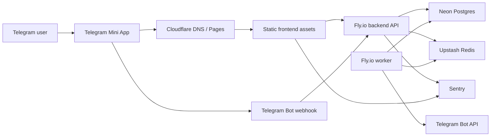

# Production environment plan

Task: [P4-DEP-001](https://github.com/anry88/New-Universe/issues/81)  
Decision date: 2026-05-13  
Target stage: initial near-free production / closed alpha

This document chooses the first production topology before irreversible deployment automation is written. It is intentionally conservative: spend almost nothing, keep state in managed services, avoid committing secrets, and leave a clear path to a paid soft-launch setup when usage proves it is needed.

## Decision summary

Use the near-free provider mix below for the first public HTTPS environment:

- **Frontend**: Cloudflare Pages Free, built from `frontend/` with `npm run build`.
- **Backend API**: Fly.io Machines, one tiny `shared-cpu-1x` app running `node dist/index.js`.
- **Worker**: Fly.io Machines, a separate tiny private app/process running `npm run worker`.
- **Postgres**: Neon Free for closed alpha; upgrade to Neon Launch before broad soft launch.
- **Redis**: Upstash Redis Free for closed alpha; upgrade to Fixed 250MB or another managed Redis if BullMQ command volume or compatibility requires it.
- **DNS/TLS**: Cloudflare DNS/proxy with provider TLS. A custom domain is preferred, but provider HTTPS hostnames can be used for an internal closed alpha.
- **Secrets**: provider secret stores and GitHub Environments only. No production `.env` files, tokens, dumps, or private keys are committed to the repo.

This target is expected to cost **$0-10/month plus domain registration** for a closed alpha. New Fly.io organizations no longer receive broad always-free compute allowances, so a realistic always-on API + worker pair is closer to **$5-8/month** before bandwidth and optional domain cost.

## Topology

## Service responsibilities

| Service | First target | Responsibility | Runtime notes |
| --- | --- | --- | --- |
| Frontend | Cloudflare Pages Free | Serves the Vite Telegram Mini App, brand assets, and static HTML/CSS/JS. | Build command: `cd frontend && npm ci && npm run build`. Output: `frontend/dist`. Set `VITE_API_URL` to the backend HTTPS origin. |
| Backend API | Fly.io tiny Machine | Runs Fastify routes, Telegram auth, game APIs, webhook handling, rate limits, and Sentry backend instrumentation. | Use the existing backend production image target. Start command is `node dist/index.js`. Public HTTPS is required. |
| Worker | Fly.io tiny Machine, no public service | Runs BullMQ workers for building/research/ship/expedition ticks, notifications, cargo routes, and production orders. | Start command is `npm run worker`. Keep exactly one worker process for the closed alpha unless idempotency/load tests justify more. |
| Postgres | Neon Free | Stores durable game state, users, resources, buildings, research, expeditions, colonies, notifications, and production orders. | Use the pooled connection string where possible. Treat Neon Free limits as closed-alpha only. |
| Redis | Upstash Redis Free | BullMQ queues/repeat jobs, rate-limit state, and short-lived coordination keys. | Use the Redis/TCP URL with TLS, not REST-only credentials. Watch command volume closely; BullMQ can exceed free limits. |
| DNS/TLS | Cloudflare | Owns `app.<domain>` and `api.<domain>` when a domain exists; can proxy the app and API. | Cloudflare Pages gives HTTPS automatically. Fly also provides TLS; put Cloudflare in front only after webhook and real IP behavior are verified. |
| Object storage | Cloudflare R2 Free, optional | Stores encrypted logical backups if we add scheduled `pg_dump` before soft launch. | Do not use R2 for runtime game state. Current app assets are static frontend files. |
| Observability | Sentry Free + VictoriaMetrics/vmalert + Grafana | Captures frontend/backend exceptions plus `/metrics` time-series for API, worker queues, DB/Redis health, and aggregate product analytics. | Alert and dashboard definitions live in [`docs/production/observability.md`](observability.md); keep scrape access private or protected at the network edge. |

## Domains

| Purpose | Closed-alpha option | Preferred custom domain | Notes |
| --- | --- | --- | --- |
| Mini App frontend | `*.pages.dev` | `https://app.<domain>` | `PUBLIC_FRONTEND_URL` and BotFather Mini App URL must point here. |
| Backend API | `*.fly.dev` | `https://api.<domain>` | `VITE_API_URL` points here. Keep CORS origin allowlisting as a pre-launch hardening item. |
| Telegram webhook | `https://api.<domain>/webhook/telegram` | Same | Configure Telegram webhook secret with `TELEGRAM_BOT_SECRET`. |
| Status page | Provider dashboard first | `https://status.<domain>` later | Optional for closed alpha. |

## Secrets strategy

Production secrets must live outside the repository. Allowed stores:

- Fly.io app secrets for backend and worker runtime values.
- Cloudflare Pages encrypted environment variables for frontend build-time values.
- GitHub Environments / Actions secrets for deployment credentials.
- Provider consoles for Neon, Upstash, Sentry, Cloudflare, Telegram, and domain registrar credentials.

Disallowed stores:

- Git-tracked `.env` files.
- Markdown docs, issue comments, PR bodies, screenshots, terminal logs, or task metadata.
- Docker image layers or build args that persist secrets.
- Shared local shell history.

| Variable | Secret? | Runtime owner | Store | Rotation notes |
| --- | --- | --- | --- | --- |
| `DATABASE_URL` | Yes | Backend, worker | Fly.io secrets | Rotate through Neon. Stop worker before switching if migration/restore is involved. |
| `REDIS_URL` | Yes | Backend, worker | Fly.io secrets | Rotate through Upstash/Redis provider. Validate BullMQ queues after rotation. |
| `TELEGRAM_BOT_TOKEN` | Yes | Backend, worker | Fly.io secrets | Rotate in BotFather; webhook and notifications stop until updated. |
| `TELEGRAM_BOT_SECRET` | Yes | Backend | Fly.io secrets + Telegram webhook config | 32+ chars in production. Rotate by updating backend secret, redeploying, then resetting webhook. |
| `JWT_SECRET` | Yes | Backend | Fly.io secrets | 32+ chars in production. Rotation invalidates sessions unless dual verification is implemented. |
| `SERVER_SECRET` | Yes | Backend | Fly.io secrets | Long-lived. It seeds deterministic home systems, so rotation needs a separate compatibility plan. |
| `SENTRY_DSN` | Yes-ish | Backend | Fly.io secrets | DSN is not a credential with database access, but keep it out of docs/logs. |
| `PUBLIC_FRONTEND_URL` | No, config | Backend | Fly.io secrets/config | Required in production startup checks. |
| `TELEGRAM_APP_URL` | No, config | Backend | Fly.io secrets/config | Required in production startup checks. |
| `VITE_API_URL` | No, public config | Frontend | Cloudflare Pages env | Embedded in the frontend bundle. |
| `VITE_TG_BOT_NAME` | No, public config | Frontend | Cloudflare Pages env | Embedded in the frontend bundle. |
| `VITE_SENTRY_DSN` | Public DSN | Frontend | Cloudflare Pages env | Embedded in the frontend bundle. |
| `ADMIN_TELEGRAM_IDS` | Sensitive config | Backend | Fly.io secrets | Comma-separated Telegram IDs; do not publish. |
| `ADMIN_TELEGRAM_CHAT_IDS` | Sensitive config | Backend | Fly.io secrets | Optional comma-separated private/group/supergroup chat IDs that receive `/paysupport` refund requests. If empty, admin user IDs are used as direct-message support destinations. |

Production startup already rejects weak `JWT_SECRET`, `SERVER_SECRET`, and `TELEGRAM_BOT_SECRET`, and requires `PUBLIC_FRONTEND_URL` / `TELEGRAM_APP_URL`. Keep that gate aligned with `docs/security/launch-checklist.md`.

## Deployment approach

This task does not create irreversible deployment automation. The first implementation should be a documented manual deploy, then a GitHub Actions workflow can automate the same steps later.

Manual sequence for the first environment:

1. Create provider projects: Cloudflare Pages, Fly.io backend app, Fly.io worker app, Neon project, Upstash Redis database, Sentry projects.
2. Configure all provider secrets from the matrix above.
3. Run local verification before deploy: `./scripts/ci-verify.sh` when Docker is available.
4. Build and deploy backend image to the API app.
5. Run Drizzle migrations against Neon from a controlled one-off backend container.
6. Start or restart the backend API.
7. Start or restart the worker after migrations finish.
8. Deploy frontend to Cloudflare Pages with `VITE_API_URL` set to the API origin.
9. Configure Telegram Mini App URL and webhook secret.
10. Smoke test `/health`, `/auth/telegram`, `/me`, one worker-driven timer, and one Telegram notification path.

## Rollback approach

| Surface | Rollback action | Data considerations |
| --- | --- | --- |
| Frontend | Promote the previous Cloudflare Pages deployment. | Safe when API contract is backward compatible. |
| Backend API | Redeploy the previous immutable image tag on Fly.io. | Safe only if the current DB schema is compatible with the previous code. |
| Worker | Redeploy the previous worker image tag or stop the worker while triaging. | Stop worker first if jobs could amplify a bad deploy. |
| Postgres migration | Prefer a forward-fix migration. For destructive mistakes, stop worker/API writes, take a dump, then use Neon restore/branching within the available restore window. | Free tier restore windows are short. Treat restores as disaster recovery, not normal rollback. |
| Redis queues | Pause/stop worker, inspect queues, then resume or drain only after confirming idempotency. | Redis is not the source of durable game state, but duplicate jobs can trigger DB writes if code is faulty. |
| Telegram webhook | Reset webhook to the previous API URL or delete it temporarily. | Telegram may retry updates; handlers must remain idempotent. |

Rollback rule: if a release includes a schema migration, decide rollback compatibility before deploy. If compatibility is unknown, the rollback plan is "stop writes, forward-fix, or restore from backup", not "blindly run the old image".

## Cost estimate

Prices are public-plan estimates checked on 2026-05-13. Real bills depend on provider changes, region, traffic, taxes/VAT, and overage settings. Set billing alerts at every provider before inviting testers.

| Component | Near-free target | Expected closed-alpha cost | Source / trigger to upgrade |
| --- | --- | ---: | --- |
| Frontend | Cloudflare Pages Free | $0 | Free plan includes 500 builds/month and unlimited static requests/bandwidth ([Cloudflare Pages](https://pages.cloudflare.com/)). Upgrade only for team/build limits. |
| Backend API | Fly.io `shared-cpu-1x` 512MB | about $3.32/mo if always on | Fly lists `shared-cpu-1x` 512MB at about $3.32/month in common regions ([Fly pricing](https://fly.io/docs/about/pricing/)). Upgrade when p95 latency or memory pressure appears. |
| Worker | Fly.io `shared-cpu-1x` 256-512MB | about $2.02-$3.32/mo if always on | Keep one worker for closed alpha. Upgrade when queues lag or memory pressure appears. |
| Postgres | Neon Free | $0 | Free plan has 100 CU-hours/month and 0.5GB storage per project ([Neon pricing](https://neon.com/pricing)). Upgrade to Launch before broad soft launch or if storage/compute exceeds 70% of free limits. |
| Redis | Upstash Redis Free | $0 | Free plan has 256MB and 500K commands/month ([Upstash pricing](https://upstash.com/pricing/redis)). BullMQ may exceed this; upgrade to Fixed 250MB ($10/mo) if command volume is high. |
| Object backups | Cloudflare R2 Free | $0 | R2 Free includes 10GB-month storage and free egress ([R2 pricing](https://developers.cloudflare.com/r2/pricing/)). Use for encrypted logical backup artifacts only after backup automation exists. |
| Error tracking | Sentry Developer/Free | $0 | Use until event volume/team access requires Team ($26/mo listed by Sentry). Backend/frontend DSNs are configured separately. |
| Metrics / alerts | VictoriaMetrics + vmalert + Grafana, tiny self-hosted or provider-managed | $0-10+ depending on hosting | P4-OPS-001 adds Prometheus-compatible `/metrics`, VictoriaMetrics alert rules, and a Grafana dashboard. Use provider metrics only as fallback; product analytics panels need the app scrape endpoint. |
| Analytics | Local structured logs + optional PostHog key + aggregate `/metrics` rollup | $0 | P4-ANA-001 adds local-first taxonomy and emitters. Backend logs `analytics.event`; frontend dispatches `nu:analytics`. P4-OPS-001 adds `player_activity_daily` aggregate panels for active players, play time, and system development. PostHog remains disabled unless `VITE_POSTHOG_KEY` is intentionally configured. |
| Domain | Provider of choice | about $10-20/year | Optional for internal closed alpha, required before public branding and stable BotFather config. |

Expected first bill:

- Existing legacy/free Fly allowance: **$0-2/month** plus optional domain.
- New Fly organization with always-on API + worker: **about $5-8/month** plus optional domain.
- If Upstash Free is too small for BullMQ: add **$10/month**.
- If Neon Free is too small: move to Neon Launch usage-based, usually **about $15/month** for intermittent small production load.

The soft-launch paid path remains: Cloudflare Pages + Fly/Hetzner compute + Neon Launch + Upstash Fixed/managed Redis + Sentry Team, roughly **$35-70/month** before heavier observability.

## Operational limits and upgrade triggers

| Limit | Watch | Upgrade trigger |
| --- | --- | --- |
| Cold starts / tiny CPU | API p95/p99 latency, Telegram webhook timeouts | p95 > 500ms for 15 minutes, webhook retries, or auth complaints from testers. |
| Postgres free tier | Neon CU-hours, storage, connections, restore window | Any metric above 70% for a week, or before inviting users outside the trusted alpha group. |
| Redis free tier | Upstash command count, latency, queue lag | Above 60% command quota mid-month, BullMQ compatibility issue, or queue lag > 2 minutes. |
| Worker singleton | BullMQ delayed/repeat queue depth | Queue depth grows during normal traffic or timers complete late. |
| Observability free tier | Sentry event quota and alert coverage | New errors are dropped, more than one maintainer needs dashboard access, or perf debugging is needed. |
| Manual deploys | Deploy time and operator mistakes | More than one production deploy per week or more than one maintainer deploying. |

## Pre-launch gaps

These are not blockers for this planning task, but they must be handled before a broad launch:

- Add a production CORS allowlist instead of registering `@fastify/cors` with defaults.
- Add a deep readiness endpoint or deploy check that verifies Postgres and Redis, not only process health from `/health`; `/metrics` already exposes `nu_db_available` and `nu_redis_available` for monitoring.
- Decide whether to use Fly.io process groups, two Fly apps, or a tiny VM before writing deploy automation.
- Validate BullMQ against the chosen Upstash Redis endpoint with a real worker smoke test.
- Add backup automation and restore rehearsal before any non-test users create durable state.
- Fix or avoid the frontend Docker production target: `frontend/Dockerfile` references `frontend/nginx.conf`, which is absent today. Cloudflare Pages avoids this for the first target.
- Define image tag conventions before GitHub Actions deploy automation is added.

## Review checklist

- [x] Production topology is documented with service responsibilities.
- [x] Secrets strategy is documented and excludes repository storage.
- [x] Deployment target is chosen: Cloudflare Pages + Fly.io Machines + Neon Free + Upstash Free for closed alpha.
- [x] Rollback approach is chosen for frontend, backend, worker, Postgres, Redis, and Telegram webhook.
- [x] Open infrastructure costs are estimated with current public pricing and explicit upgrade triggers.
- [x] Known pre-launch gaps are listed before irreversible automation work begins.
