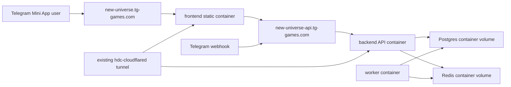

# Windows Docker host migration runbook

Created: 2026-06-02
Target: migrate the currently live staging environment to a purchased-domain Windows host while keeping the cloud deployment path reversible.

This runbook is the first preparation layer. It does not replace the existing Fly.io, Neon, Upstash, or Cloudflare Pages deployment workflow.

## Current status

As of 2026-06-02, the staging environment has been cut over to the Windows Docker host:

- Public frontend: `https://new-universe.tg-games.com`
- Public API: `https://new-universe-api.tg-games.com`
- Telegram webhook: `https://new-universe-api.tg-games.com/webhook/telegram`
- Compose project: `new-universe-prod`
- Windows Postgres data: `D:\new-universe\state\prod\postgres`
- Windows Redis data: `D:\new-universe\state\prod\redis`
- Final staging dump backup: `D:\new-universe\backups\postgres\prod\final-cutover-20260602.dump`
- Previous Windows pre-final backup: local operator temp copy was created during cutover; take a fresh Windows-host backup before any later rollback or destructive restore.
- Active deploy command: `scripts/deploy-hdc.sh --environment prod`

The old Fly.io staging API and worker were scaled to zero during cutover. Neon, Upstash, Fly apps, and Cloudflare Pages were not deleted. Returning to cloud is a data migration from the Windows Postgres state back into Neon or a new cloud database, followed by redeploying the existing cloud workflow and moving the Telegram webhook back.

## Goals

- Run the game on a single Windows machine through Docker Linux containers.
- Keep the application portable: backend and worker still use `DATABASE_URL` and `REDIS_URL`, and frontend still uses `VITE_API_URL`.
- Keep the existing cloud staging resources as the fallback path until Windows has accepted real traffic and rollback data handling is understood.
- Support a second instance on the same host for rehearsal and future tests.
- Avoid committing host secrets, dumps, tokens, private domains, or raw `.env` files.

## Non-goals

- Do not rewrite the app to assume local-only infrastructure.
- Do not remove or disable the current GitHub Actions Fly/Cloudflare workflow.
- Do not automate destructive database maintenance.
- Do not migrate Redis as durable source-of-truth data unless a later audit finds Redis-only game state. The project docs describe Postgres rows as the durable timer and game-state source; Redis/BullMQ is a queue/cache layer.

## Target topology



The second instance uses the same compose pattern with a different project name, domains, env file, and volumes. Backend and worker images can be identical across instances. The frontend currently reads `VITE_API_URL` at build time, so either build a frontend image per environment or add a later runtime-config / relative `/api` proxy path before assuming one frontend image can serve both prod and test.

| Instance | Compose project | App domain | API domain | Data |
| --- | --- | --- | --- | --- |
| Main | `new-universe-prod` | `new-universe.tg-games.com` | `new-universe-api.tg-games.com` | migrated staging dump |
| Test | `new-universe-test` | `test.new-universe.tg-games.com` | `test-new-universe-api.tg-games.com` | rehearsal copy or disposable test data |

## Windows host prerequisites

Use Windows only as the host operating system. The application containers should run as Linux containers through Docker Desktop/WSL2 or an equivalent Linux VM on the Windows machine.

Host checklist:

- Virtualization enabled in BIOS/UEFI.
- WSL2 available if Docker Desktop is used.
- Docker Desktop or Docker Engine capable of running Linux containers.
- Docker Compose plugin available through `docker compose`.
- Postgres container major version must match the source Neon database major version for migration. The current staging source is PostgreSQL 17, so the Docker-host stack uses `postgres:17-alpine`.
- PowerShell 7 preferred for operator scripts; Windows PowerShell can run the simple preparation script.
- Enough persistent disk for Postgres volume, image cache, backups, and at least one restore rehearsal.
- Cloudflare Tunnel available for public ingress. With Tunnel, no inbound 80/443 router/NAT or Windows Firewall openings are required for the game.
- DNS records for `new-universe`, `new-universe-api`, `test.new-universe`, and `test-new-universe-api` routed through Cloudflare Tunnel.
- A private operator access path for deployments. Prefer a self-hosted GitHub runner on the machine or a narrowly scoped SSH/VPN path; do not expose database or Redis ports publicly.
- Existing Docker workloads may already own host ports. The Docker-host stack is designed for that: no service publishes host ports, and Cloudflare Tunnel reaches the app over internal Compose service names.

Suggested local directory layout on the host:

```text
C:\new-universe\
  backups\
    postgres\
      prod\
      test\
    redis\
      prod\
      test\
  deploy\
    prod\
    test\
  env\
  logs\
    prod\
    test\
  state\
    prod\
      postgres\
      redis\
    test\
      postgres\
      redis\
  tmp\
```

`infra/docker-host/windows/prepare-host.ps1` creates this layout and writes a local starter env file if one does not already exist.

## Environment ownership

The Windows host gets local env files under `C:\new-universe\env\`. These files are operational secrets and must not be copied into the repository.

Minimum main-instance values:

| Variable | Owner | Notes |
| --- | --- | --- |
| `COMPOSE_PROJECT_NAME` | Compose | `new-universe-prod`; test uses `new-universe-test`. |
| `POSTGRES_USER`, `POSTGRES_PASSWORD`, `POSTGRES_DB` | Postgres container | Used to initialize the local Postgres volume. |
| `DATABASE_URL` | Backend, worker, migration one-offs | Internal container URL such as `postgres://...@postgres:5432/...`. |
| `REDIS_URL` | Backend, worker | Internal container URL such as `redis://redis:6379`. |
| `POSTGRES_DATA_TYPE`, `POSTGRES_DATA_SOURCE` | Compose storage | Use `bind` and `D:/new-universe/state/prod/postgres` on the real Windows host so Postgres data lives outside the container. |
| `REDIS_DATA_TYPE`, `REDIS_DATA_SOURCE` | Compose storage | Use `bind` and `D:/new-universe/state/prod/redis` for Redis persistence outside the container. |
| `TELEGRAM_BOT_TOKEN` | Backend, worker | Staging bot token until BotFather cutover changes are planned. |
| `TELEGRAM_BOT_SECRET` | Backend | Must match the Telegram webhook secret set during cutover. |
| `JWT_SECRET`, `SERVER_SECRET` | Backend | Keep current staging values if the Windows host takes over the same player sessions and deterministic world seed. |
| `PUBLIC_FRONTEND_URL`, `TELEGRAM_APP_URL` | Backend | `https://new-universe.tg-games.com` for the main instance. |
| `VITE_API_URL`, `VITE_TG_BOT_NAME` | Frontend build-time values | `https://new-universe-api.tg-games.com` and the Telegram bot username. Build one frontend image per environment unless a later runtime-config or relative `/api` proxy path is added. |
| `HDC_TUNNEL_NETWORK` | Compose networking | Shared Docker network used by the existing Home Data Center `hdc-cloudflared` connector. Default: `hdc-tunnel`. |
| `TUNNEL_FRONTEND_ALIAS`, `TUNNEL_API_ALIAS` | Compose networking | Stable service aliases for Cloudflare public hostname routes, e.g. `nu-prod-frontend` and `nu-prod-api`. |
| `SENTRY_DSN`, `VITE_SENTRY_DSN` | Optional | Keep disabled or use staging DSNs deliberately. |

Production startup rejects weak `JWT_SECRET`, `SERVER_SECRET`, and `TELEGRAM_BOT_SECRET`, and requires `PUBLIC_FRONTEND_URL` and `TELEGRAM_APP_URL`. Keep that gate active on Windows.

## Preparation sequence

1. Run host preparation:

```powershell
pwsh .\infra\docker-host\windows\prepare-host.ps1 `
  -Environment prod `
  -Root C:\new-universe `
  -Domain tg-games.com
```

2. Create the test instance directories too:

```powershell
pwsh .\infra\docker-host\windows\prepare-host.ps1 `
  -Environment test `
  -Root C:\new-universe `
  -Domain tg-games.com
```

3. Fill `C:\new-universe\env\prod.env` and `C:\new-universe\env\test.env` from `infra/docker-host/windows/host.env.example`.
4. Confirm Docker and Compose:

```powershell
docker version
docker compose version
docker run --rm hello-world
```

5. Configure Cloudflare Tunnel public hostnames, but do not change Telegram webhook or Mini App URL yet.
6. Authenticate the host to the image registry once the Docker-host workflow exists. Use a read-only package token where possible.
7. Rehearse with the `test` instance before moving the main instance.

Cloudflare Tunnel hostname mapping through the existing Home Data Center tunnel:

| Environment | Public hostname | Tunnel service URL |
| --- | --- | --- |
| prod | `new-universe.tg-games.com` | `http://nu-prod-frontend:8080` |
| prod | `new-universe-api.tg-games.com` | `http://nu-prod-api:3000` |
| test | `test.new-universe.tg-games.com` | `http://nu-test-frontend:8080` |
| test | `test-new-universe-api.tg-games.com` | `http://nu-test-api:3000` |

The `hdc-cloudflared` container lives in the Home Data Center `infra` compose project. It must be attached to the same `hdc-tunnel` Docker network as the New Universe frontend/API services so Cloudflare can resolve these aliases without publishing host ports.

## Docker-host stack

The initial host stack lives in [`infra/docker-host/compose.yml`](../../infra/docker-host/compose.yml). It is separate from root `docker-compose.yml`, which remains the development stack.

Core properties:

- no fixed `container_name` values, so `new-universe-prod` and `new-universe-test` can run side by side;
- Postgres and Redis are private Docker-network services with no host ports, and real Windows deployments use bind-mounted host directories under `D:/new-universe/state/<env>/`;
- the existing Home Data Center Cloudflare Tunnel is the public ingress path, with HTTPS terminating at Cloudflare and outbound-only connections from the Windows host;
- backend API and worker share the same production image;
- frontend is served by the Node static container and built with environment-specific `VITE_*` values;
- `migrate` is a `tools` profile service for the single controlled `db:migrate` + `db:seed` step.

Config-only verification from a developer machine:

```bash
bash scripts/docker-host-verify.sh
```

Build and isolated health checks when Docker image builds are allowed:

```bash
RUN_DOCKER_HOST_BUILD=1 RUN_DOCKER_HOST_STACK=1 bash scripts/docker-host-verify.sh
```

Run the isolated smoke test directly on the Home Data Center Docker context:

```bash
DOCKER_CONTEXT=hdc RUN_DOCKER_HOST_BUILD=1 RUN_DOCKER_HOST_STACK=1 bash scripts/docker-host-verify.sh
```

Windows-host command shape after env files are filled:

```powershell
docker compose `
  --env-file C:\new-universe\env\prod.env `
  -f .\infra\docker-host\compose.yml `
  config
```

Do not start a second `cloudflared` from this stack. Use the existing Home Data Center tunnel service and add public hostname routes to the aliases above.

The migration service must be run deliberately:

```powershell
docker compose `
  --env-file C:\new-universe\env\prod.env `
  -f .\infra\docker-host\compose.yml `
  --profile tools `
  run --rm migrate
```

## Staging data migration rehearsal

The first migration must be a rehearsal into the `test` instance.

1. Keep live staging running.
2. Create a Neon staging dump with `pg_dump --format=custom --no-owner --no-acl`.
3. Restore that dump into the test Postgres volume.
4. Run Drizzle migrations and idempotent seeders once against the test database.
5. Start the test backend, frontend, and worker.
6. Smoke test:
   - `GET /health`
   - `GET /metrics`
   - Telegram auth through the test URL, if a test bot/domain is available
   - `GET /me`
   - one due worker timer
   - one notification path when safe

Do not rehearse by pointing a test backend at the live staging database. The test instance must use its own Postgres volume.

## Main cutover outline

The first cutover was executed on 2026-06-02. Use the same sequence for future repeat migrations or rollback drills:

1. Announce a maintenance window.
2. Stop the staging worker first.
3. Stop or gate staging API writes.
4. Take the final Neon dump.
5. Restore into the Windows main Postgres volume.
6. Run migrations and seeders once.
7. Start Windows API/frontend.
8. Smoke test `/health`, `/metrics`, Telegram auth, `/me`, and one worker timer with worker still stopped when practical.
9. Point the Telegram webhook to `https://new-universe-api.tg-games.com/webhook/telegram`.
10. Point BotFather Mini App URL to `https://new-universe.tg-games.com`.
11. Start the Windows worker.
12. Keep Fly, Neon, Upstash, and Cloudflare Pages resources available with their worker stopped until the new data path is stable.

## Returning to cloud

Returning to cloud after Windows accepts writes is a data migration, not a simple DNS rollback:

1. Stop the Windows worker.
2. Stop or gate Windows API writes.
3. Take a fresh `pg_dump` from the Windows Postgres volume.
4. Restore into Neon staging or a new Neon branch.
5. Update Fly runtime secrets back to the target Neon `DATABASE_URL` and managed Redis `REDIS_URL`.
6. Deploy the existing cloud API/worker images or run the existing `.github/workflows/deploy.yml`.
7. Build/deploy Cloudflare Pages with the cloud API `VITE_API_URL`.
8. Move Telegram webhook and Mini App URL back to the cloud origins.
9. Start the cloud worker after migrations and smoke tests pass.

This is why the first Windows cutover should not happen until the test-instance restore and rollback rehearsal have been completed.

## Open implementation tasks

- Run `prepare-host.ps1` and `docker compose config` on the Windows host.
- Build images on the host or in GitHub, then run an isolated test instance from a staging dump.
- Add a Docker-host deploy script used by both GitHub Actions and local operators.
- Decide whether the Docker-host frontend is built per environment or changed to runtime config / relative `/api` proxying.
- Add a GitHub Actions workflow that builds/pushes images to the selected registry and triggers the Windows host deploy path.
- Add explicit backup and restore commands once the compose service names and volume names are finalized.
